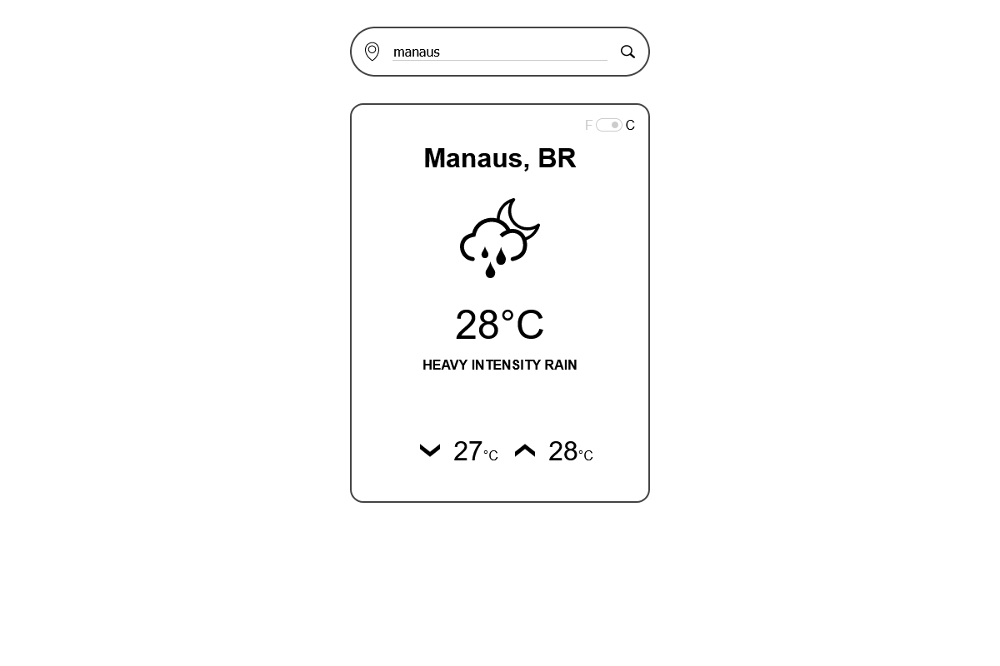

# Weather Now

> What's the weather like?



A simple weather app that allows you to get the weather forecast of a given location. Powered by OpenWeather API.

## Built With

- HTML & CSS
- JavaScript
- OpenWeather API

## Live Demo

[Click here to see a live demo of this project](https://brenoxav.github.io/weather)


## Getting Started

To get a local copy up and running follow these simple example steps.

### Prerequisites

- A web browser

### Setup

- Clone or download the project to your local machine

- Change to the project's root directory
```
weather
```

- Open the `index.html` file on your preferred browser
```
/dist/index.html
```

### Scripts
- Run in development mode and watch for changes
```
npm run dev
```
- Compile in production mode
```
npm run build
```

## Author

👨‍💻 **Breno Xavier**

- GitHub: [@brenoxav](https://github.com/brenoxav)
- Twitter: [@brenoxav](https://twitter.com/brenoxav)
- LinkedIn: [Breno Xavier](https://linkedin.com/in/brenoxav)

## Show your support

Give a ⭐️ if you like this project!

## Acknowledgments

- Microverse
- Odin Project
